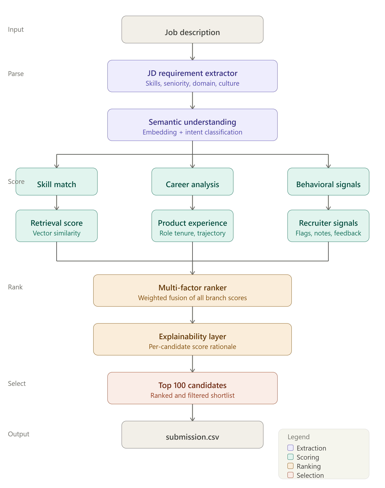
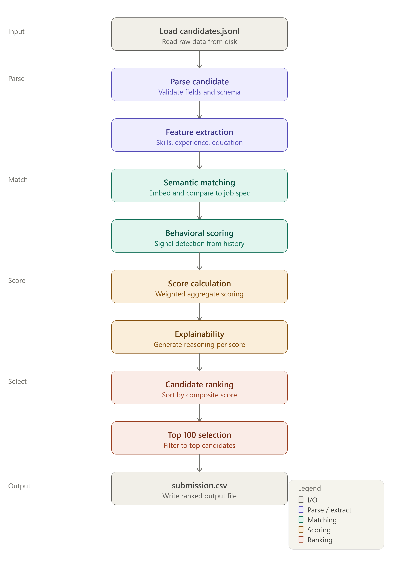
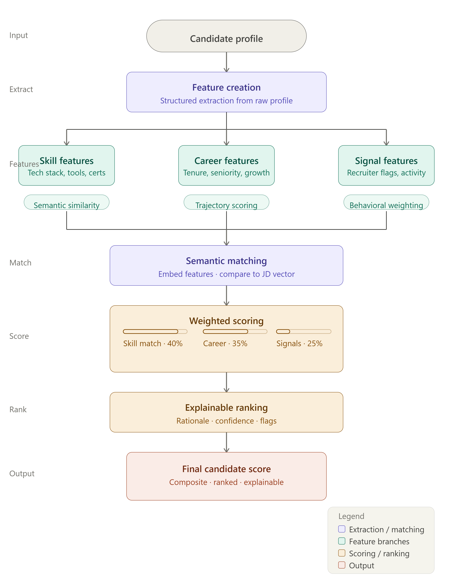

# 🚀 Intelligent Candidate Discovery

## Data & AI Challenge 2026

An AI-powered candidate ranking system designed to intelligently identify and rank the most relevant candidates for a Senior AI Engineer role using candidate profiles, career history, skills, and behavioral signals.

---

## 👨‍💻 Developer

**Kona Venkata Datta Sai Krishna**
B.Tech – Computer Science & Engineering (Artificial Intelligence)
Amrita Vishwa Vidyapeetham, Amaravati
Graduation: 2026

GitHub: https://github.com/Dattuking

---

# 🎯 Problem Statement

Traditional Applicant Tracking Systems (ATS) rely heavily on keyword matching, often overlooking highly qualified candidates whose experience is described differently.

The objective of this project is to build an intelligent candidate discovery system capable of:

* Understanding job requirements
* Evaluating candidate relevance
* Leveraging behavioral hiring signals
* Ranking candidates intelligently
* Providing explainable recommendations

---

# 📊 Dataset Overview

The challenge dataset contains:

* 100,000 Candidate Profiles
* Skills & Technologies
* Career History
* Education Details
* Certifications
* Languages
* Behavioral Signals

### Behavioral Signals Used

* Open To Work Status
* Recruiter Response Rate
* Interview Completion Rate
* Offer Acceptance Rate
* GitHub Activity Score
* Profile Completeness
* Search Appearances
* Saved By Recruiters

---

# 🏗️ System Architecture



### Architecture Flow

Job Description → Requirement Understanding → Feature Engineering → Candidate Evaluation → Ranking Engine → Explainability Layer → Top Candidate Selection

---

# 🔄 Workflow



### Workflow Steps

1. Load Candidate Dataset
2. Parse Candidate Information
3. Extract Candidate Features
4. Evaluate Behavioral Signals
5. Calculate Candidate Score
6. Rank Candidates
7. Generate Submission File

---

# 📈 Methodology



The system combines:

### Technical Signals

* Skill Matching
* Experience Matching
* Job Title Relevance
* Career Progression

### Behavioral Signals

* Recruiter Engagement
* Profile Completeness
* GitHub Activity
* Open-To-Work Status

### Ranking Signals

* Candidate Relevance
* Professional Activity
* Hiring Readiness

---

# ⚙️ Features Used

| Category   | Features                  |
| ---------- | ------------------------- |
| Experience | Years of Experience       |
| Skills     | Technical Skills          |
| Profile    | Current Job Title         |
| Behavioral | Recruiter Response Rate   |
| Behavioral | Interview Completion Rate |
| Behavioral | GitHub Activity Score     |
| Behavioral | Profile Completeness      |
| Hiring     | Open To Work Status       |

---

# 🧮 Candidate Scoring

The final candidate score is computed using weighted profile and behavioral factors.

### Score Components

* Experience Match
* Recruiter Response Rate
* Interview Completion Rate
* Profile Completeness
* GitHub Activity
* Open-To-Work Status

The Top 100 candidates are selected based on the final ranking score.

---

# 📂 Repository Structure

```text
Intelligent-Candidate-Discovery/

├── docs/
│   ├── architecture.png
│   ├── workflow.png
│   └── methodology.png
│
├── outputs/
│   └── submission.csv
│
├── src/
│   ├── config.py
│   ├── jd_parser.py
│   ├── feature_extractor.py
│   ├── semantic_matcher.py
│   ├── scorer.py
│   ├── explainability.py
│   ├── rank_candidates.py
│   └── utils.py
│
├── main.py
├── requirements.txt
├── README.md
└── .gitignore
```

---

# 🚀 Installation

Clone the repository:

```bash
git clone https://github.com/Dattuking/Intelligent-Candidate-Discovery.git
```

Move into project folder:

```bash
cd Intelligent-Candidate-Discovery
```

Install dependencies:

```bash
pip install -r requirements.txt
```

---

# ▶️ Run Project

```bash
python main.py
```

---

# 📄 Output

The system generates:

```text
outputs/submission.csv
```

Format:

```csv
candidate_id,rank,score,reasoning
```

Example:

```csv
CAND_001245,1,0.946321,"Strong experience and recruiter signals"
```

---

# 🔍 Explainability

Every ranked candidate includes:

* Candidate Score
* Ranking Position
* Recruiter-Friendly Explanation

Example:

> Strong experience and recruiter signals

This ensures transparency in ranking decisions.

---

# 📊 Results

✅ Successfully processed 100,000 candidate profiles

✅ Generated Top 100 ranked candidates

✅ Submission file validated successfully

✅ GitHub repository published

---

# 🌟 Future Enhancements

* Learning-to-Rank (XGBoost Ranker)
* Semantic Embeddings
* Hybrid Retrieval Systems
* Candidate Knowledge Graph
* LLM-Based Re-ranking
* Real-Time Recruiter Feedback Loop

---

# 🏆 Project Outcome

This solution demonstrates how AI-driven ranking can improve candidate discovery beyond traditional keyword-based filtering while maintaining scalability for large candidate datasets.

---

## Team
**KONA VENKATA DATTA SAI KRISHNA**
**PromptStorm**

**Data & AI Challenge 2026**

**Intelligent Candidate Discovery**
